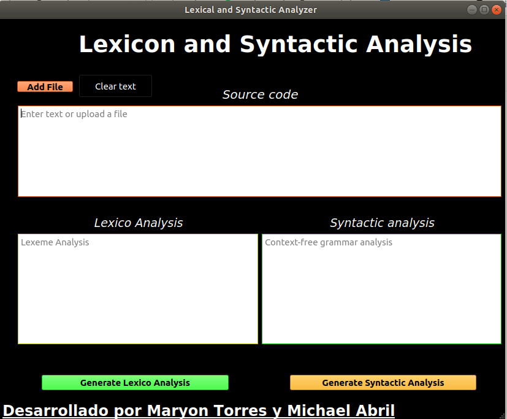

# Lexical and syntactic analyzer using PLY

    PLY is an implementation of lex and yacc analysis tools for Python.
  
    This project was developed with the collaboration of Maryon Torres, whose objective was to implement some of the phases
    that  a compiler requires. Developing in the course of compilers QI2017 at the Inter-American University of Panama

## Preconditions

## Installation
    Installation is simple. The basic dependencies are standard Unix utilities / commands. If you experience some problems
    during the installation, please check that they are met; see the dependencies section for what you need specifically.
    
        **https://github.com/Michaelabril/Lexical-and-syntactic-analyzer-using-PLY-.git

## Run the application
        To run the application we must enter the shell and go to the path where the project is located and execute the
        following command
        
            **python3 main.py
